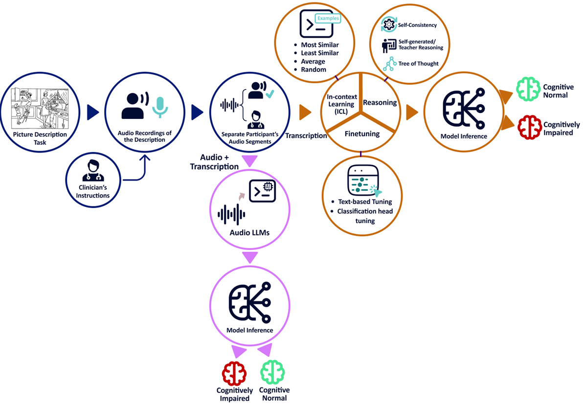

# Speech-Based Cognitive Screening: A Systematic Evaluation of LLM Adaptation Strategies

<!-- [](link_to_paper) -->

## Overview

This repository accompanies our paper:  
**Speech-Based Cognitive Screening: A Systematic Evaluation of LLM Adaptation Strategies**

We systematically evaluate **large language model (LLM)** adaptation strategies for detecting **Alzheimer’s disease and related dementias (ADRD)** using the **DementiaBank** speech corpus.  
The experiments span two main components:

- 📝 **Text-Based LLMs** — models operating on *transcripts only*  
- 🎧 **Audio-Based (Multimodal) LLMs** — models using *paired audio + transcripts*

In addition, external generalizability was evaluated on the **DementiaBank Delaware Dataset**.

Each subdirectory contains its own README with detailed setup, methods, and evaluation results.

---

## Abstract

Over half of adults with Alzheimer’s disease and related dementias (ADRD) remain undiagnosed.  
Speech-based screening with LLMs offers a scalable solution, but the comparative value of **different adaptation strategies** is not well understood.

We evaluate multiple **LLM families and adaptation strategies** for cognitive impairment detection across **text-only** and **multimodal (audio + text)** input types:

1. **In-Context Learning (ICL)** – with four demonstration selection strategies (*most similar, least similar, average to class centroids/prototype, random*)  
2. **Reasoning-Augmented Prompting** – including *self-/teacher-generated rationales*, *self-consistency*, and *Tree-of-Thought (ToT)* with domain-expert roles  
3. **Parameter-Efficient Fine-Tuning** – comparing *token-level supervision* vs *classification-head adaptation*  
4. **Multimodal Integration** – using models capable of processing *audio–transcript pairs*

### 🔍 Key Findings

- 🧩 *Prototype demonstrations* achieved the best ICL results (F1 up to **0.81**).  
- 💭 *Reasoning augmentation* improved smaller models (e.g., LLaMA-8B: **0.72 → 0.76**).  
- 🔧 *Token-level fine-tuning* consistently yielded top scores (F1 up to **0.83**).  
- 🧠 *Classification heads* helped weaker models under token-level setups.  
- 🎙️ *Multimodal models* were competitive but did not surpass top-performing text-only systems.

---

## 🏗️ Repository Structure

<pre>
├── text_based_LLMs/            # Text-only LLM experiments
│ ├── README.md                 # Component 1–3: ICL, Reasoning, Fine-tuning
│ ├── component1_ICL.ipynb
│ ├── component2_ICL_reasoningBased_methods.ipynb
│ ├── component3_1_tokenBased_finetuning_GPT.ipynb
│ ├── component3_1_tokenBased_finetuning_openWeightModels.ipynb
│ └── component3_2_classificationHead_finetuning.ipynb

├── audio_based_LLMs/            # Multimodal (Audio + Text) LLM experiments
│ ├── README.md                  # Component 4: Multimodal evaluation
│ ├── qwen_finetuning/
│ └── phi_finetuning/

└── figures/
└── figure1.png                  # Architecture overview
</pre>

---

## Architecture

<p align="center">
  
</p>

---

## 📚 Citation

If you use this repository or our results in your research, please cite:

> **Speech-Based Cognitive Screening: A Systematic Evaluation of LLM Adaptation Strategies**  
> *Fatemeh Taherinezhad, Mohamad Javad Momeni Nezhad, Sepehr Karimi, Sina Rashidi, Ali Zolnour, Maryam Dadkhah, Yasaman Haghbin, Hossein AzadMaleki, Maryam Zolnoori*  
> *arXiv preprint arXiv:2509.03525 (2025)*  
> [https://arxiv.org/abs/2509.03525](https://arxiv.org/abs/2509.03525)

BibTeX:
```bibtex
@article{taherinezhad2025speech,
  title={Speech-Based Cognitive Screening: A Systematic Evaluation of LLM Adaptation Strategies},
  author={Taherinezhad, Fatemeh and Nezhad, Mohamad Javad Momeni and Karimi, Sepehr and Rashidi, Sina and Zolnour, Ali and Dadkhah, Maryam and Haghbin, Yasaman and AzadMaleki, Hossein and Zolnoori, Maryam},
  journal={arXiv preprint arXiv:2509.03525},
  year={2025}
}
```

---

## 📄 License

This repository is licensed under the **Creative Commons Attribution 4.0 International (CC BY 4.0)** license.  
You are free to share and adapt this work, provided that appropriate credit is given.  
See the [LICENSE](LICENSE) file for details.
